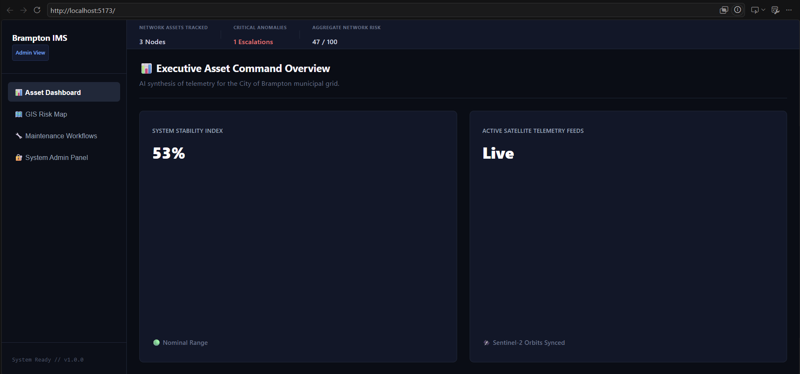

🏙️ Brampton Infrastructure Management System (CivicPulse)

A secure, decoupled 4-tier smart-city platform designed to help municipal authorities monitor, manage, and predict infrastructure risks using satellite telemetry and real-time data analytics.

📖 Project Overview
Municipal governments manage tens of thousands of distributed physical assets (roads, water mains, bridges) relying on fragmented, reactive data streams. The Brampton Infrastructure Management System provides city officials with predictive, real-time visibility into structural health. By processing satellite anomaly data and crowdsourced civic reports, the platform calculates automated risk scores, allowing engineers to prioritize interventions before catastrophic structural failures occur.

🏗️ System Architecture
The platform is engineered around a strict 4-tier architecture to decouple the visual interfaces from the analytical engines and persistence layers:

1. Access Layer (Frontend): A responsive, viewport-locked (100vh) Enterprise SaaS dashboard built with React (Vite). Features dynamic Role-Based Access Control (RBAC), GIS map rendering, and internal flexbox scrollframes.

2. Application Layer (Backend): A secure Node.js & Express.js REST API server acting as an AppSec shield. It handles routing, middleware validation, and database communication.

3. Integration Layer (AI/Telemetry): Automates the ingestion of Earth observation telemetry (Landsat/Sentinel) to detect ground displacement and synthesize normalized 0-100 infrastructure health indices.

4. Persistence Layer (Database): A PostgreSQL relational database (optimized for PostGIS spatial extensions) maintaining transactional integrity for geographic records and encrypted maintenance workflows.

🛡️ Enterprise Security Implementations
Security was treated as a foundational requirement rather than an afterthought.

Defensive Gateway Validation: Utilizes strict Joi validation schemas in the Express middleware to inspect and sanitize all incoming payloads before processing.

SQL Injection (SQLi) Prevention: Strict enforcement of Parameterized Queries ($1, $2) via the pg client to ensure user inputs are evaluated solely as literal strings, neutralizing code injection.

Secret Leakage Mitigation: Cryptographic keys, JWT secrets, and database connection strings are entirely abstracted into local .env variables, paired with strict .gitignore tracking directives to prevent repository exposure.

Role-Based Access Control (RBAC): Frontend pathways map user credentials using native .filter() methods to actively prevent unauthorized administrative UI nodes from rendering in the DOM.

Secure Logging: Implements Winston for detailed internal error tracking while returning sanitized, generic error objects to the client to prevent database schema disclosure.

💻 Tech Stack
Frontend: React.js, Vite, CSS3 (Flexbox Viewport Budgeting)

Backend: Node.js, Express.js

Database: PostgreSQL

Security & Middleware: Helmet, Joi, Winston, dotenv

🚀 Getting Started
To run this application locally, you will need two separate terminal windows to spin up the decoupled client and server environments.

Prerequisites
Node.js installed

PostgreSQL installed and running locally

Git

1. Server Setup (Backend)
Navigate to the server directory and start the Node.js API:

Bash
cd server
npm install
# Ensure your local .env file is configured with your PG database credentials
npm run dev
2. Client Setup (Frontend)
Open a new terminal, navigate to the client directory, and start the React application:

Bash
cd client
npm install
npm run dev
Navigate to http://localhost:5173 in your web browser to view the dashboard.